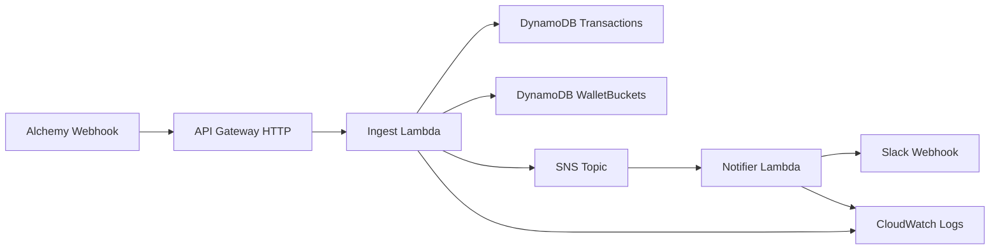
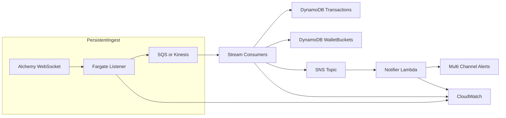

# Serverless ETH Watcher

Portfolio-scale serverless pipeline that ingests Alchemy webhook events, tracks ETH flow for a target wallet, and emits Slack-ready alerts when rolling thresholds are exceeded. It started as a fork-of-the-ideas from the original [eth-watcher](https://github.com/yermakovsa/eth-watcher) WebSocket runner, but I re-scoped it into a fully serverless design so I could showcase cloud-native tradeoffs. I treat it like a production system: typed contracts, IaC, isolated Lambdas, and deterministic tests per service.

## System Goals
- Mirror real-world on-call scenarios: detect anomalous ETH movement for a wallet across `from` and `to` directions.
- Replace brittle local scripts with scalable managed primitives (API Gateway → Lambda → DynamoDB → SNS → Lambda).
- Keep operating cost near zero by leveraging On-Demand billing, zero-idle compute, and IaC reproducibility.
- Provide clear upgrade paths that demonstrate full-stack and cloud-architecture thinking.

## Architecture



- **Ingest Lambda (`services/ingest/src/mvp`):** validates Alchemy payloads, deduplicates transactions, writes both `from` and `to` perspectives, and aggregates ETH totals into 60-second buckets.
- **DynamoDB tables:** Open-ended on-demand throughput; per-direction PKs keep reads bounded while a sentinel PK manages cooldowns.
- **SNS topic + Notifier Lambda:** decouples alert publication from delivery; notifier fans out Slack payloads and surfaces HTTP failures for DLQ handling.
- **Observability:** CloudWatch metrics/logs on both handlers plus explicit structured logs inside mocks to surface replayable payloads.

## Runtime Flow
1. Alchemy posts a signed Address Activity payload.
2. API Gateway HTTP API forwards the request without transformation.
3. Ingest Lambda parses, rejects non-ETH assets, upserts transaction and bucket rows via the AWS SDK v3 client abstractions, and publishes threshold breach messages to SNS.
4. SNS buffers bursts and retries delivery automatically.
5. Notifier Lambda turns SNS messages into Slack-compatible JSON and calls the configured webhook, failing fast on non-2xx responses.

## Data + Assumptions
- Focused exclusively on ETH transfers; ignoring ERC20/NFT assets keeps writes small and deterministic.
- Rolling windows are configurable via environment (`THRESHOLD_ETH`, `WINDOW_SECONDS`, `COOLDOWN_SECONDS`, `BUCKET_SIZE_SECONDS`).
- Wallets are treated symmetrically across `from`/`to`; each hash only counts once because dedupe guards use PK hashes.
- Schema definitions live under [services/ingest/types/alchemyWebhookTypes.ts](services/ingest/types/alchemyWebhookTypes.ts) and are enforced both at compile-time and via lightweight runtime guards in [services/ingest/src/mvp/simpleIngestHandler.ts](services/ingest/src/mvp/simpleIngestHandler.ts).

## Tests & Quality Gates
- **Unit suites per Lambda.**
  - [services/ingest/test/simpleIngestHandler.test.ts](services/ingest/test/simpleIngestHandler.test.ts) and [services/ingest/test/minimalIngestHandler.test.ts](services/ingest/test/minimalIngestHandler.test.ts) run under `npm --prefix services/ingest test`, mocking DynamoDB/SNS primitives while exercising the real handler code.
  - [services/notifier/test/handler.test.ts](services/notifier/test/handler.test.ts) covers Slack payload generation, malformed SNS inputs, and HTTP failure handling.
- **Provisioning lambda coverage.** [services/webhook-manager/test/handler.test.ts](services/webhook-manager/test/handler.test.ts) simulates the Alchemy admin API via mocked fetch calls to guarantee we keep provisioning idempotent.
- Root [jest.config.cjs](jest.config.cjs) fans test runs into each service-specific config so CI can run `npm test` at the repo root.

## Repository Structure (MVP)
- [services/ingest](services/ingest) – Lambda source in `src/mvp`, mock payloads under `mock_events`, Jest unit tests under `test`, bundled output in `dist`.
- [services/notifier](services/notifier) – Slack notifier Lambda plus focused Jest config and mocks.
- [services/webhook-manager](services/webhook-manager) – provisioning Lambda that ensures Alchemy webhooks exist before events flow into API Gateway.
- [infra/terraform](infra/terraform) – API Gateway, Lambda functions, IAM roles, DynamoDB tables, and SNS topic expressed as modules for reproducible deploys.
- [secrets/](secrets) – placeholder for non-committed configuration (env files, keys, etc.).
- [README.md](README.md) – this document; treat it as living design documentation.

```
serverless-eth-watcher/
├─ infra/
│  └─ terraform/
├─ services/
│  ├─ ingest/
│  │  ├─ mock_events/
│  │  ├─ src/mvp/
│  │  └─ test/
│  ├─ notifier/
│  │  ├─ src/
│  │  └─ test/
│  └─ webhook-manager/
│     ├─ src/
│     └─ test/
├─ secrets/
├─ README.md
└─ coverage/
```

## Delivery & Operations Posture
- Terraform state captures the whole stack so environments can be recreated in minutes; IAM least-privilege roles keep blast radius low.
- Cold-start resilience via environment-driven configuration, deterministic mocks, and ability to add Provisioned Concurrency without code changes.
- Alert pipeline is durable because SNS provides at-least-once delivery and decouples ingestion spikes from Slack rate limits; DLQ hooks are documented in [infra/terraform](infra/terraform).

This codebase demonstrates full-stack ownership: typed handlers, automated tests, deterministic mocks, IaC, and clear operational guardrails—all wrapped in a concise serverless MVP that is cheap to run yet easy to extend.

## Scaling Path & Improvements

1. **SQS buffering layers** can sit between API Gateway → ingest or SNS → notifier to smooth bursts, backpressure Slack, and make retries observable.
2. **Persistent ingest tier** (Fargate listener + WebSocket + SQS/Kinesis) eliminates cold starts and guarantees ordering for institutional traffic while the existing Lambdas become consumers.
3. **Channel expansion + playbooks** by adding more SNS subscriptions (Email, PagerDuty, custom webhooks) and attaching DLQs for each target so operational handoffs stay audited.



- Adds a long-lived Fargate service to keep WebSockets open without Lambda cold starts.
- Buffers events with SQS/Kinesis to guarantee ordering and absorb spikes before DynamoDB writes.
- Keeps the downstream SNS + notifier topology unchanged so additional channels can subscribe without code churn.
- Trade-offs: higher baseline cost, additional operational surface area (container health, stream retention), but unlocks institutional throughput and deterministic ordering when stakes justify it.
