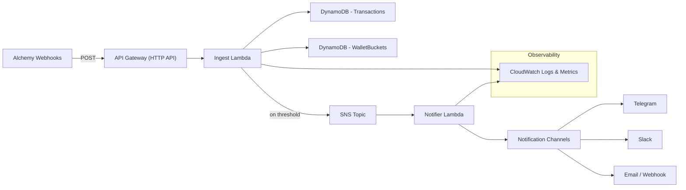

# Serverless ETH Watcher

A minimal, serverless rework of the `eth-watcher` project: an Ethereum transaction watcher that detects high-volume activity for configured wallets and sends alerts.

This repository contains the code, infrastructure templates, and demo assets to deploy a fully serverless pipeline on AWS using API Gateway → Lambda → DynamoDB → SNS → Lambda (notifier).

**Goals**
- Convert the local WebSocket watcher to a serverless pipeline (using Alchemy webhooks).
- Keep costs minimal (serverless, on-demand DynamoDB, HTTP API).
- Provide clear infra (SAM/Terraform), CI/CD, and demo assets for a portfolio.

**Architecture (high level)**



Why this approach
- Fully serverless (no always-on container) if Alchemy supports webhooks.
- DynamoDB time-buckets allow cheap sliding-window aggregation.
- SNS decouples alerting and allows multi-channel delivery.
- Low-cost at low traffic (Lambda + HTTP API + on-demand DynamoDB).
Why this approach
- Fully serverless (no always-on container) if Alchemy supports webhooks.
- DynamoDB time-buckets allow cheap sliding-window aggregation.
- SNS decouples alerting and allows multi-channel delivery via subscribers.
- Low-cost at low traffic (Lambda + HTTP API + on-demand DynamoDB).

Repository layout
- `cmd/` - application entry points (original watcher code)
- `internal/` - packages: `aggregator`, `notifier`, `watcher`, `config`
- `infra/` - SAM or Terraform templates (to be added)
- `examples/` - sample webhook payloads and demo scripts
- `.github/workflows/` - CI/CD workflows

Quick start (local development)
1. Install prerequisites: Go, AWS SAM CLI (if using SAM), Docker (for local Lambda testing).
2. Build and run locally (example with SAM):

```bash
# from project root
cd infra
sam build
sam local start-api --env-vars env.json
# POST a sample payload
curl -X POST http://127.0.0.1:3000/webhook -H "Content-Type: application/json" -d @../examples/sample-webhook.json
```

Deploy (high level)
- Option A (SAM): `sam deploy --guided` from `infra/` after filling env vars and AWS credentials.
- Option B (Terraform): `terraform init` and `terraform apply` in `infra/terraform`.

Security & secrets
- Store Telegram bot token and any API keys in `AWS Secrets Manager` (do not commit them).
- Protect the webhook endpoint: validate Alchemy signature or require an API key.
Security & secrets
- Store any API keys or secrets in `AWS Secrets Manager` (do not commit them).
- Protect the webhook endpoint: validate Alchemy signature or require an API key.

Cost control tips
- Use API Gateway HTTP API (cheaper than REST API).
- Use Lambda with small memory for simple handlers (128–256 MB).
- Start DynamoDB on-demand and enable TTL for old items.
- Remove or tear down stacks after demos (see `scripts/cleanup.sh`).

Next steps (for this repo)
- Add `infra/` SAM template and IAM roles (I can generate a starter).
- Implement Go Lambda handler(s) reusing `ParseValue` and notification logic.
- Add GitHub Actions for CI/CD and consider OIDC for AWS creds.
Next steps (for this repo)
- Add `infra/` SAM template and IAM roles (I can generate a starter).
- Implement Go Lambda handler(s) reusing `ParseValue` and publish alerts to SNS.
- Add GitHub Actions for CI/CD and consider OIDC for AWS creds.

License
- Add a license file (MIT recommended for portfolios).

Contact
- If you want, I can generate the SAM template and Go Lambda skeleton next. Which would you prefer?

**Based on**

This project is a serverless rework and adaptation of the original repository: https://github.com/yermakovsa/eth-watcher.  
Credit to the original author; please refer to the original project's license and notices when reusing code.
