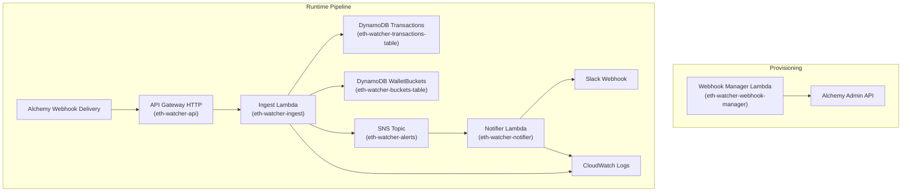
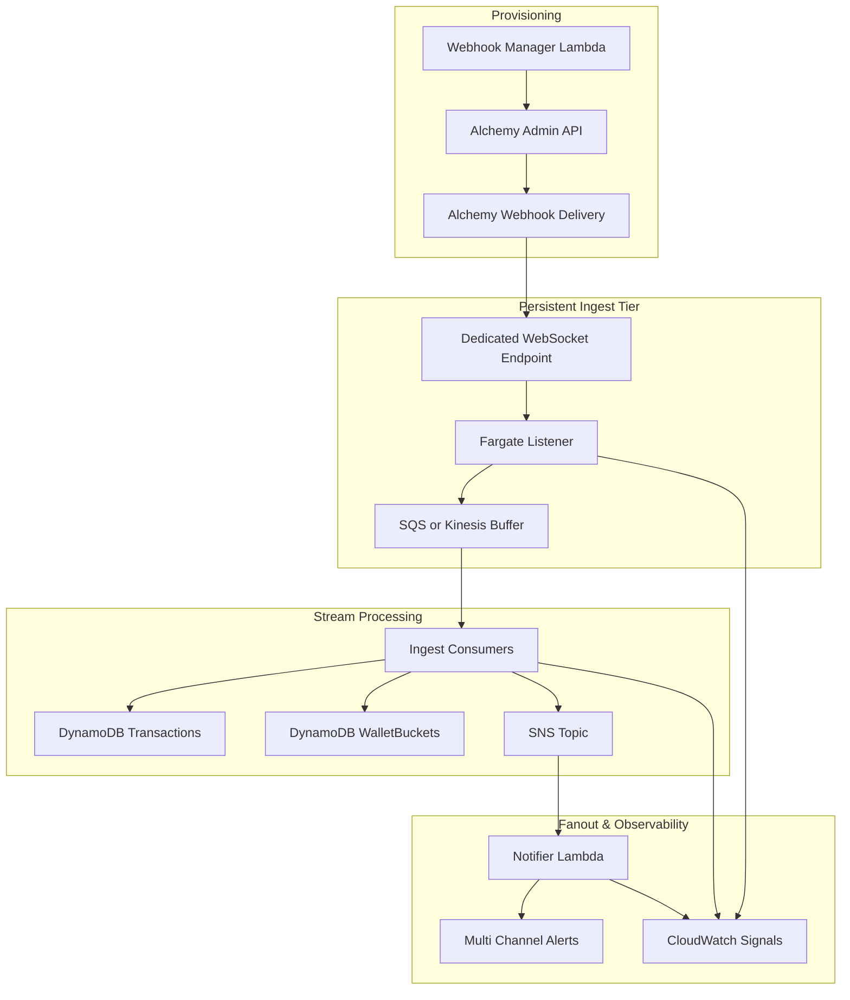

# Serverless ETH Watcher

Portfolio-scale serverless pipeline that ingests Alchemy webhook events, tracks ETH flow for any configured set of wallets, and emits Slack-ready alerts when rolling thresholds are exceeded. It started as a fork-of-the-ideas from the original [eth-watcher](https://github.com/yermakovsa/eth-watcher) WebSocket runner, but I re-scoped it into a fully serverless design so I could showcase cloud-native tradeoffs. I treat it like a production system: typed contracts, IaC, isolated Lambdas, and deterministic tests per service.

## System Goals

- Mirror real-world on-call scenarios: detect anomalous ETH movement for any tracked wallet across `from` and `to` directions.
- Replace brittle local scripts with scalable managed primitives (API Gateway → Lambda → DynamoDB → SNS → Lambda).
- Keep operating cost near zero by leveraging On-Demand billing, zero-idle compute, and IaC reproducibility.
- Provide clear upgrade paths that demonstrate full-stack and cloud-architecture thinking.

## Architecture



- **Webhook Manager Lambda (`services/webhook-manager`):** thin provisioning helper that calls the Alchemy admin API to create the Address Activity webhook for the configured delivery URL. For simplicity it always issues a POST and does **not** check for pre-existing webhooks.
- **Ingest Lambda (`services/ingest/src/handler.ts`):** validates Alchemy payloads, deduplicates transactions, writes both `from` and `to` perspectives, and aggregates ETH totals into buckets sized by `BUCKET_SIZE_SECONDS` (default 60 seconds). Deployed as `eth-watcher-ingest`. The earlier MVP implementation still lives under `services/ingest/src/mvp` purely as supporting reference.
- **Notifier Lambda:** consumes SNS alerts and delivers to Slack. Deployed as `eth-watcher-notifier`.
- **DynamoDB tables:** Open-ended on-demand throughput; per-direction PKs keep reads bounded while a sentinel PK manages cooldowns. Deployed as `eth-watcher-transactions-table` and `eth-watcher-buckets-table`.
- **SNS topic + Notifier Lambda:** decouples alert publication from delivery; notifier fans out Slack payloads and surfaces HTTP failures for DLQ handling. Topic deployed as `eth-watcher-alerts`.
- **API Gateway:** HTTP API endpoint for Alchemy webhook delivery. Deployed as `eth-watcher-api`.
- **Observability:** CloudWatch metrics/logs on both handlers plus explicit structured logs inside mocks to surface replayable payloads.

## Improvements over the original eth-watcher

This project is a cloud-native, serverless evolution of the original long-running ETH watcher. The core improvements are architectural and operational:

- **Event-driven & serverless:** replaced a persistent WebSocket process with Alchemy webhooks + AWS Lambda, enabling zero idle compute, automatic scaling, and a simpler operational model.
- **Durable aggregation & deduplication:** moved from in-memory aggregation to DynamoDB-backed state, enabling safe retries, deduplication, cooldown windows, and historical inspection.
- **Clear service boundaries:** split responsibilities into independent services (ingestion, aggregation & persistence, notification), which are easier to extend, test, and reason about.
- **Pluggable notifications:** introduced SNS as an alerting backbone to decouple event detection from delivery (Slack today, extensible to email, PagerDuty, etc.).
- **Infrastructure as Code:** full Terraform-managed AWS infrastructure for reproducible deployments and environment parity.
- **Production-oriented design:** runtime validation of webhook payloads, explicit idempotency and failure handling, and unit/integration testing per service.

### Trade-offs

- Increased architectural complexity and AWS coupling compared to a single binary.
- Slightly higher latency due to serverless execution and fan-out.

Overall, the system trades simplicity for durability, extensibility, and operational robustness, making it better suited for real-world, cloud-native usage.

## Runtime Flow
1. (Optional helper) Webhook Manager Lambda posts to the Alchemy admin API to create the Address Activity webhook for the delivery URL.
2. Alchemy posts a signed Address Activity payload.
3. API Gateway HTTP API forwards the request without transformation.
4. Ingest Lambda parses, rejects non-ETH assets, upserts transaction and bucket rows via the AWS SDK v3 client abstractions, and publishes threshold breach messages to SNS.
5. SNS buffers bursts and retries delivery automatically.
6. Notifier Lambda turns SNS messages into Slack-compatible JSON and calls the configured webhook, failing fast on non-2xx responses.

## Environment Knobs
- **Ingest:** `TRANSACTIONS_TABLE`, `WALLET_BUCKETS_TABLE`, `SNS_TOPIC_ARN`, `THRESHOLD_ETH`, `WINDOW_SECONDS`, `COOLDOWN_SECONDS`, `BUCKET_SIZE_SECONDS`, `TRACKED_WALLETS`.
- **Notifier:** `SLACK_WEBHOOK_URL`, `APP_NAME`.
- **Webhook Manager:** `ALCHEMY_ADMIN_API_KEY`, `ALCHEMY_APP_ID`, `ALCHEMY_DELIVERY_URL`, optional `ALCHEMY_API_BASE_URL`, and `TRACKED_WALLETS` (falls back to two sample addresses when unset).
- These knobs let you swap wallet lists, adjust rolling-window math, or repoint Slack/Alchemy targets without code changes; see each service’s `env.ts` for details.

## Infrastructure

For Terraform setup, deployment steps, and module details, see [infra/terraform/README.md](infra/terraform/README.md).

## Tests & Quality Gates
- **Ingest service:** [services/ingest/test/unit](services/ingest/test/unit) and [services/ingest/test/integration](services/ingest/test/integration) focus on the production handler in `src/handler.ts`, while targeted specs inside [services/ingest/test/mvp](services/ingest/test/mvp) (for example [services/ingest/test/mvp/simpleIngestHandler.test.ts](services/ingest/test/mvp/simpleIngestHandler.test.ts)) cover the legacy MVP/minimal runners and the ingest↔notifier handshake. Shared mocks/helpers live in [services/ingest/test/support/testUtils.ts](services/ingest/test/support/testUtils.ts) so every suite pulls from the same cloning, response-assertion, and structured typing helpers.
- **Notifier service:** [services/notifier/test/handler.test.ts](services/notifier/test/handler.test.ts) asserts Slack payload formatting, JSON validation, and webhook error handling.
- **Webhook manager:** [services/webhook-manager/test/handler.test.ts](services/webhook-manager/test/handler.test.ts) mocks the Alchemy admin API to guarantee the provisioning helper issues the right POST payload.
- Each service keeps its own `test/` folder so local or CI runners can execute the relevant suites without touching other stacks.

## Repository Structure
- [services/ingest](services/ingest) – production ingest Lambda in `src/handler.ts`, shared types under `types/`, mocks under `mock_events/`, and service-level tests in `test/`. Deployed as `eth-watcher-ingest`. The early-stage MVP variant persists under `src/mvp/` strictly as supporting reference.
- [services/notifier](services/notifier) – Slack notifier Lambda with its own env wiring and tests. Deployed as `eth-watcher-notifier`.
- [services/webhook-manager](services/webhook-manager) – helper Lambda that posts to the Alchemy admin API to create the Address Activity webhook. Deployed as `eth-watcher-webhook-manager`; reruns simply create another webhook pointing to the same delivery URL.
- [infra/terraform](infra/terraform) – Complete infrastructure as code using Terraform modules: API Gateway (`eth-watcher-api`), Lambda functions, IAM roles, DynamoDB tables (`eth-watcher-transactions-table`, `eth-watcher-buckets-table`), and SNS topic (`eth-watcher-alerts`) for reproducible deploys across environments.
- [secrets/](secrets) – placeholder for non-committed configuration (env files, keys, etc.).
- [README.md](README.md) – this document; treat it as living design documentation.

```
serverless-eth-watcher/
├── infra/
│   └── terraform/
│       ├── modules/
│       │   ├── dynamodb/
│       │   ├── sns/
│       │   ├── lambda_function/
│       │   └── api_gateway_http/
├── services/
│   ├── ingest/
│   │   ├── src/
│   │   │   └── mvp/
│   │   ├── test/
│   │   │   ├── unit/
│   │   │   ├── integration/
│   │   │   └── mvp/
│   │   ├── types/
│   │   └── mock_events/
│   ├── notifier/
│   │   ├── src/
│   │   └── test/
│   └── webhook-manager/
│       ├── src/
│       └── test/
```

## Delivery & Operations Posture
- Terraform state captures the whole stack so environments can be recreated in minutes; IAM least-privilege roles keep blast radius low. See [infra/terraform](infra/terraform) for the complete IaC setup with all resource names and configuration.
- Cold-start resilience via environment-driven configuration, deterministic mocks, and ability to add Provisioned Concurrency without code changes.
- Alert pipeline is durable because SNS provides at-least-once delivery and decouples ingestion spikes from Slack rate limits; DLQ hooks are documented in [infra/terraform](infra/terraform).

This codebase demonstrates full-stack ownership: typed handlers, automated tests, deterministic mocks, IaC, and clear operational guardrails—all wrapped in a concise serverless MVP that is cheap to run yet easy to extend.

## Scaling Path & Improvements

1. **SQS buffering layers** can sit between API Gateway → ingest or SNS → notifier to smooth bursts, backpressure Slack, and make retries observable.
2. **Persistent ingest tier** (Fargate listener + WebSocket + SQS/Kinesis) eliminates cold starts and guarantees ordering for institutional traffic while the existing Lambdas become consumers.
3. **Channel expansion + playbooks** by adding more SNS subscriptions (Email, PagerDuty, custom webhooks) and attaching DLQs for each target so operational handoffs stay audited.



- Adds a long-lived Fargate service to keep WebSockets open without Lambda cold starts while the webhook manager still provisions delivery endpoints the exact same way.
- Buffers events with SQS/Kinesis to guarantee ordering and absorb spikes before DynamoDB writes.
- Keeps the downstream SNS + notifier topology unchanged so additional channels can subscribe without code churn, and centralizes observability hooks across the new layers.
- Trade-offs: higher baseline cost, additional operational surface area (container health, stream retention), but unlocks institutional throughput and deterministic ordering when stakes justify it.
